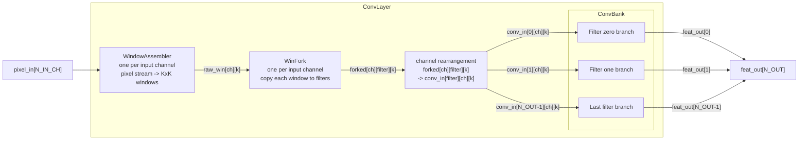
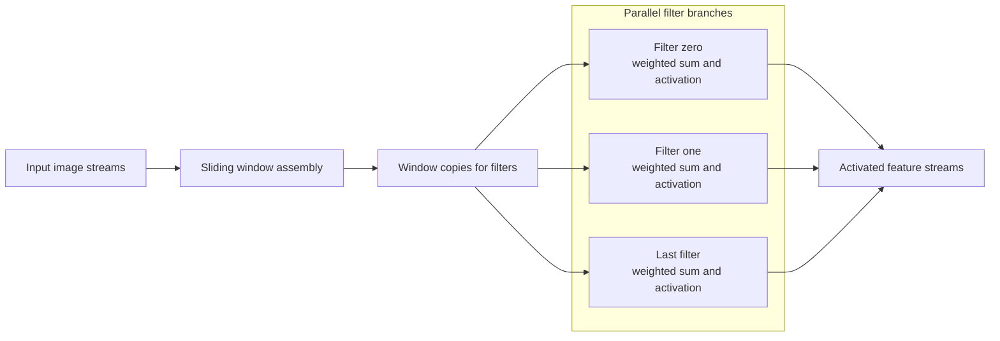
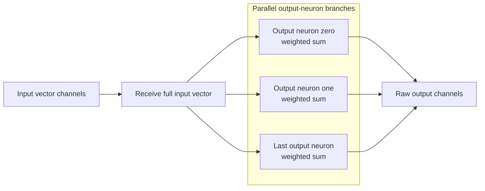
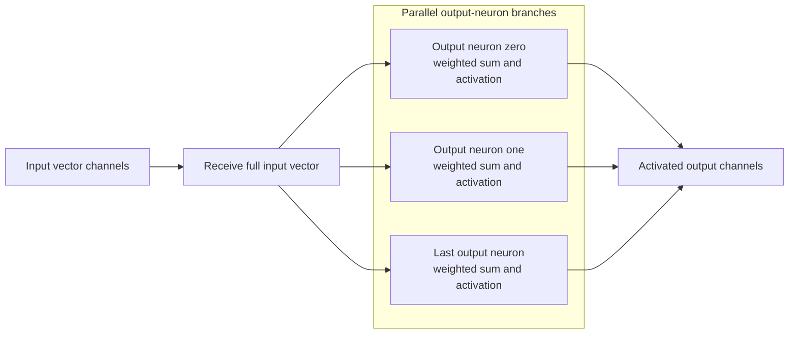

# Neural Network Layer Templates

This document explains `nn_layers.act`, a reusable ACT layer library for
fixed-point neural-network pipelines.

All public data ports use `math::fixpoint<8,8>` channels. The library supports
two different ways to provide layer parameters: compile-time template parameters and runtime channel parameters

## Layer Set

`nn_layers.act` defines these reusable templates:

| Template                 | Role                                                                   |
| ------------------------ | ---------------------------------------------------------------------- |
| `Activation`           | Standalone activation process                                          |
| `WindowAssembler`      | Converts an image stream into sliding convolution windows              |
| `WinFork`              | Copies one window to multiple convolution filters                      |
| `ConvBank`             | Generic homogeneous convolution bank                                   |
| `ConvLayer`            | Raw convolution layer wrapper                                          |
| `ConvLayerAct`         | Convolution layer with inline activation                               |
| `MaxPool2x2Ch`         | 2x2 max-pooling for one feature-map channel                            |
| `MaxPool2x2`           | Multi-channel 2x2 max-pooling wrapper                                  |
| `Flatten`              | Serializes feature-map channels into one flat stream                   |
| `FlattenToParallel`    | Flattens feature maps into parallel vector channels                    |
| `FCLayer`              | Raw fully connected layer with parallel fixed-point inputs and outputs |
| `FCLayerAct`           | Fully connected layer with inline activation                           |
| `FCLayerParamSource`   | Sends one runtime dense-layer parameter set                            |
| `FCLayerParam`         | Fully connected layer with weights and biases received over channels   |
| `FCLayerActParam`      | Runtime-parameter fully connected layer with activation                |
| `ConvLayerParamSource` | Sends one runtime convolution parameter set                            |
| `ConvBankParam`        | Runtime-parameter convolution compute bank                             |
| `ConvLayerParam`       | Convolution layer with weights and biases received over channels       |
| `ConvLayerActParam`    | Runtime-parameter convolution layer with activation                    |

## Parameter Input Styles

`nn_layers.act` has two parallel families of layer templates.

| Style                      | Templates                                                                        | How parameters enter                                           | When to use                                                                         |
| -------------------------- | -------------------------------------------------------------------------------- | -------------------------------------------------------------- | ----------------------------------------------------------------------------------- |
| Compile-time parameters    | `FCLayer`, `FCLayerAct`, `ConvLayer`, `ConvLayerAct`                     | `preal` template arrays such as `W` and `B`              | Parameters are known when writing/compiling the ACT file                            |
| Runtime channel parameters | `FCLayerParam`, `FCLayerActParam`, `ConvLayerParam`, `ConvLayerActParam` | `math::fixpoint<8,8>` channels such as `w_in` and `b_in` | Parameters should come from another process, loader, memory interface, or testbench |

The runtime channel-parameter layers still have fixed dimensions at compile
time. For example, `FCLayerParam<8, 2>` always has 8 inputs and 2 outputs, but
the 16 weights and 2 biases are received as channel tokens.

Parameter-source helpers are included for examples and tests:

| Source template          | Sends                           |
| ------------------------ | ------------------------------- |
| `FCLayerParamSource`   | One dense-layer weight/bias set |
| `ConvLayerParamSource` | One convolution weight/bias set |

These helpers are not required in a real system. Any process can drive the
parameter channels as long as it sends values in the required order.

## `Activation`

`Activation<ACT_FN; LEAK>` is a standalone activation block:

```act
defproc Activation (chan?(math::fixpoint<8,8>) in;
                           chan!(math::fixpoint<8,8>) out)
```

Parameters:

| Parameter  | Meaning                                                                |
| ---------- | ---------------------------------------------------------------------- |
| `ACT_FN` | Activation selector.                                                   |
| `LEAK`   | Slope used only for leaky ReLU. Use `0.0` for linear, step, or ReLU. |

Activation codes:

| `ACT_FN` | Name       | Output                                                  |
| ---------- | ---------- | ------------------------------------------------------- |
| `0`      | Linear     | input value                                             |
| `1`      | Step       | `1.0` if input is non-negative, otherwise `0.0`     |
| `2`      | ReLU       | input value if non-negative, otherwise `0.0`          |
| `3`      | Leaky ReLU | input value if non-negative, otherwise `LEAK * input` |

The implementation tests fixed-point sign using:

```act
~value.negative()
```

That condition is true when the value is non-negative.

It receives one fixed-point token, applies the selected activation, and sends
one fixed-point token. `ConvLayer` and `FCLayer` emit raw weighted sums, so use
this template when the next stage needs step/ReLU/leaky-ReLU output.

## `WindowAssembler`

`WindowAssembler<IMG_W, IMG_H, K>` receives one image channel as a row-major
fixed-point stream and emits valid `K*K` windows:

```act
defproc WindowAssembler (chan?(math::fixpoint<8,8>) pix_in;
                           chan!(math::fixpoint<8,8>) win[K*K])
```

Parameters:

| Parameter | Meaning                                                         |
| --------- | --------------------------------------------------------------- |
| `IMG_W` | Input image width in pixels.                                    |
| `IMG_H` | Input image height in pixels.                                   |
| `K`     | Kernel width and height. Each output window has `K*K` values. |

For an `IMG_W x IMG_H` image and a `K x K` kernel, it produces:

```text
(IMG_W - K + 1) * (IMG_H - K + 1)
```

windows. It uses a circular buffer of `K` rows, so it does not need to store the
whole image.

## `WinFork`

`WinFork<N_OUT, K>` receives one `K*K` window and broadcasts a copy to each
output filter:

```act
defproc WinFork (chan?(math::fixpoint<8,8>) win_in[K*K];
                   chan!(math::fixpoint<8,8>) win_out[N_OUT][K*K])
```

Parameters:

| Parameter | Meaning                                                                             |
| --------- | ----------------------------------------------------------------------------------- |
| `N_OUT` | Number of output copies. In convolution, this usually equals the number of filters. |
| `K`     | Kernel width and height. Each copied window has `K*K` values.                     |

ACT channels are point-to-point, so a window that feeds multiple filters must be
explicitly copied.

## `ConvBank`

`ConvBank<K, N_IN_CH, N_OUT; W, B>` is the generic bank used by `ConvLayer`:

```act
defproc ConvBank (chan?(math::fixpoint<8,8>) win[N_OUT][N_IN_CH][K*K];
                    chan!(math::fixpoint<8,8>) out[N_OUT])
```

Parameters:

| Parameter   | Meaning                                                             |
| ----------- | ------------------------------------------------------------------- |
| `K`       | Kernel width and height.                                            |
| `N_IN_CH` | Number of input channels per filter.                                |
| `N_OUT`   | Number of output filters and output feature streams.                |
| `W`       | Flattened convolution weights. Size is `N_OUT * N_IN_CH * K * K`. |
| `B`       | Bias per output filter. Size is `N_OUT`.                          |

It keeps all output filters in one homogeneous process, which avoids ACT
sparse-array type errors for arbitrary `N_OUT`. The generic bank first receives
the window values for every filter, then computes the output filters with
parallel CHP replication over `f`.

Inside each filter branch, the accumulation over input channels and kernel
positions is still sequential:

```text
parallel over filters f
  sequential over input channels ch
    sequential over kernel positions k
```

This gives filter-level parallelism without instantiating separate per-filter
template specializations.

### `ConvBankAct`

`ConvBankAct<K, N_IN_CH, N_OUT, ACT_FN; W, B, LEAK>` has the same parameters,
plus `ACT_FN` and `LEAK`. It applies activation inside each parallel filter
branch before sending the feature output.

## `ConvLayer`

`ConvLayer<IMG_W, IMG_H, K, N_IN_CH, N_OUT; W, B>` wires the convolution
sub-blocks together and emits raw weighted sums:

```act
defproc ConvLayer (chan?(math::fixpoint<8,8>) pixel_in[N_IN_CH];
                     chan!(math::fixpoint<8,8>) feat_out[N_OUT])
```

Parameters:

| Parameter   | Meaning                                                             |
| ----------- | ------------------------------------------------------------------- |
| `IMG_W`   | Input image width.                                                  |
| `IMG_H`   | Input image height.                                                 |
| `K`       | Kernel width and height.                                            |
| `N_IN_CH` | Number of input image or feature-map channels.                      |
| `N_OUT`   | Number of convolution filters and output feature-map channels.      |
| `W`       | Flattened convolution weights. Size is `N_OUT * N_IN_CH * K * K`. |
| `B`       | Bias per output filter. Size is `N_OUT`.                          |

Pipeline structure:



The runtime handshake stages are:

```text
WindowAssembler -> WinFork -> ConvBank
```

`ConvLayer` is a layer wrapper that directly instantiates these active
sub-processes. `ConvBank` contains the parallel filter branches.

Internally it creates:

1. One `WindowAssembler` per input channel.
2. One `WinFork` per input channel.
3. A channel rearrangement from `[input_channel][filter][kernel]` to
   `[filter][input_channel][kernel]`.
4. One `ConvBank` for all output filters.

The output feature-map dimensions are:

```text
OUT_W = IMG_W - K + 1
OUT_H = IMG_H - K + 1
```

Each `feat_out[f]` stream emits `OUT_W * OUT_H` fixed-point values.

### Choosing `ConvLayer` Parameters

`N_OUT` is the number of convolution filters. Increasing `N_OUT` creates more
output feature-map channels:

```text
N_OUT = 2  -> two filters  -> feat_out[2]
N_OUT = 4  -> four filters -> feat_out[4]
N_OUT = 8  -> eight filters -> feat_out[8]
```

The weight and bias array sizes must grow with `N_OUT`:

```text
number of weights = N_OUT * N_IN_CH * K * K
number of biases  = N_OUT
```

For example, with a `2x2` kernel and one input channel:

```text
N_IN_CH = 1
K       = 2

weights per filter = 1 * 2 * 2 = 4
```

So:

```text
2 filters ->  8 weights, 2 biases
4 filters -> 16 weights, 4 biases
8 filters -> 32 weights, 8 biases
```

Weights are stored filter-major:

```text
filter 0 weights
filter 1 weights
...
filter N_OUT-1 weights
```

Changing `N_OUT` also changes the downstream channel counts. If a convolution
layer changes from two filters to four filters, the following layers must also
expect four feature streams:

```text
ConvLayer output:       feat_out[4]
Activation array:       act[4]
MaxPool2x2 channels:    MaxPool2x2<4, OUT_W, OUT_H>
FlattenToParallel:      FlattenToParallel<4, POOL_H, POOL_W>
Flattened vector size:  4 * POOL_H * POOL_W
FCLayer input count:    same as flattened vector size
```

This is the main shape rule for building bigger CNNs: when the number of
filters changes, every later layer that consumes feature channels must use the
same new channel count.

### `ConvLayerAct`

`ConvLayerAct<IMG_W, IMG_H, K, N_IN_CH, N_OUT, ACT_FN; W, B, LEAK>` uses the
same windowing and filter-bank structure as `ConvLayer`, but the convolution
bank applies activation before sending each feature output.

Additional parameters:

| Parameter  | Meaning                                                   |
| ---------- | --------------------------------------------------------- |
| `ACT_FN` | Activation selector applied inside the convolution layer. |
| `LEAK`   | Leaky-ReLU slope when `ACT_FN = 3`.                     |

```text
WindowAssembler -> WinFork -> ConvBankAct
```

Use `ConvLayer` when you want activation to be an explicit pipeline stage in the
network file. Use `ConvLayerAct` when you want one layer instance to include the
activation calculation without an extra activation channel/handshake.

Pipeline structure:



`ACT_FN` uses the same activation codes as the standalone `Activation` process:
linear, step, ReLU, or leaky ReLU. The difference is placement. In
`ConvLayerAct`, activation is inside the convolution bank process. With
`ConvLayer`, activation is a separate process after the raw convolution output.

## `MaxPool2x2Ch` and `MaxPool2x2`

`MaxPool2x2Ch<FEAT_W, FEAT_H>` performs 2x2 max-pooling with stride 2 on one
feature-map stream:

```act
defproc MaxPool2x2Ch (chan?(math::fixpoint<8,8>) in;
                        chan!(math::fixpoint<8,8>) out)
```

Parameters:

| Parameter  | Meaning                                 |
| ---------- | --------------------------------------- |
| `FEAT_W` | Input feature-map width. Must be even.  |
| `FEAT_H` | Input feature-map height. Must be even. |

The pooled output size is:

```text
POOL_W = FEAT_W / 2
POOL_H = FEAT_H / 2
```

It reads two full rows at a time, compares each 2x2 block, and emits the maximum.
Because `math::fixpoint<8,8>` does not use plain integer comparison, the maximum
test is implemented with subtraction:

```act
diff := candidate - m;
[ ~diff.negative() -> m := candidate [] else -> skip ];
```

`MaxPool2x2<N_CH, FEAT_W, FEAT_H>` creates one channel process per feature-map
channel:

```act
defproc MaxPool2x2 (chan?(math::fixpoint<8,8>) feat_in[N_CH];
                      chan!(math::fixpoint<8,8>) pool_out[N_CH])
```

Parameters:

| Parameter  | Meaning                                               |
| ---------- | ----------------------------------------------------- |
| `N_CH`   | Number of feature-map channels to pool independently. |
| `FEAT_W` | Input feature-map width per channel.                  |
| `FEAT_H` | Input feature-map height per channel.                 |

`FEAT_W` and `FEAT_H` should be even.

## `Flatten` and `FlattenToParallel`

`Flatten<N_CH, FEAT_H, FEAT_W>` serializes multiple feature-map channels into
one flat fixed-point stream:

```act
defproc Flatten (chan?(math::fixpoint<8,8>) feat_in[N_CH];
                   chan!(math::fixpoint<8,8>) flat_out)
```

Parameters:

| Parameter  | Meaning                         |
| ---------- | ------------------------------- |
| `N_CH`   | Number of feature-map channels. |
| `FEAT_H` | Feature-map height per channel. |
| `FEAT_W` | Feature-map width per channel.  |

The number of output tokens per tensor is:

```text
N_CH * FEAT_H * FEAT_W
```

Output order is:

```text
channel 0, row-major
channel 1, row-major
...
channel N_CH-1, row-major
```

For example, `Flatten<2, 1, 1>` receives one value from channel `0`, then one
value from channel `1`, and emits a two-token flat stream.

`FlattenToParallel<N_CH, FEAT_H, FEAT_W>` emits to an output channel array:

```act
defproc FlattenToParallel (chan?(math::fixpoint<8,8>) feat_in[N_CH];
                             chan!(math::fixpoint<8,8>) flat_out[N_CH*FEAT_H*FEAT_W])
```

Parameters are the same as `Flatten`. The output channel count is:

```text
N_CH * FEAT_H * FEAT_W
```

It reads and emits by row, column, then channel. That interleaving avoids
blocking one feature-map channel while draining another, and it matches
`FCLayer`'s sequential input receive order:

```text
flat_out[(r*FEAT_W + c)*N_CH + ch]
```

This is the natural flatten stage before the current parallel-input `FCLayer`.

## `FCLayer`

`FCLayer<N_IN, N_OUT; W, B>` implements a dense layer with parallel input
channels and emits raw weighted sums:

```act
defproc FCLayer (chan?(math::fixpoint<8,8>) x_in[N_IN];
                   chan!(math::fixpoint<8,8>) out[N_OUT])
```

Parameters:

| Parameter | Meaning                                            |
| --------- | -------------------------------------------------- |
| `N_IN`  | Number of input activations in the vector.         |
| `N_OUT` | Number of output neurons.                          |
| `W`     | Flattened dense weights. Size is `N_OUT * N_IN`. |
| `B`     | Bias per output neuron. Size is `N_OUT`.         |

Weight layout:

```text
W[j*N_IN + i] = weight from input i to output neuron j
```

For each inference, it receives one fixed-point token from each `x_in[i]`, then
computes the `N_OUT` output neurons with parallel CHP replication:

```text
acc[j] = B[j] + sum_i W[j*N_IN + i] * x[i]
```

Each output branch has its own `acc[j]`, so the branches do not share write
state while computing. It emits the raw accumulator on each `out[j]` channel.
Add `Activation` after `FCLayer` when the output should be step/ReLU/leaky-ReLU.

Pipeline structure:



### `FCLayerAct`

`FCLayerAct<N_IN, N_OUT, ACT_FN; W, B, LEAK>` computes activation inside the
same CHP process as the weighted sum. It has the same input and output shape as
`FCLayer`, but the output tokens are already activated.

Additional parameters:

| Parameter  | Meaning                                                       |
| ---------- | ------------------------------------------------------------- |
| `ACT_FN` | Activation selector applied inside each output-neuron branch. |
| `LEAK`   | Leaky-ReLU slope when `ACT_FN = 3`.                         |

```text
receive inputs -> weighted sum -> inline activation -> output
```

Pipeline structure:



`ACT_FN` is applied inside each output-neuron branch before the send on the
output channel. That means there is no intermediate raw-output channel between
the weighted sum and activation.

Use `FCLayer` when you want separate visible pipeline stages. Use `FCLayerAct`
when you want a compact layer instance without an extra activation
channel/handshake.

Unlike the first XOR template, this library uses fixed-point outputs. Step
activation returns fixed-point values: `0.0` or `1.0`.

## Example: XOR Network

`xor_nn_fclayer.act` demonstrates how to use this library for XOR. It uses the
general `FCLayer<2,2>` template:

```act
FCLayer<2, 2,
        { 5.0, 5.0,
          5.0, 5.0 },
        { -3.0, -8.0 }> hidden_layer (input_vec, hidden_raw);
```

The hidden layer computes raw sums for:

```text
h0_raw = 5*x0 + 5*x1 - 3
h1_raw = 5*x0 + 5*x1 - 8
```

`Activation<1, 0.0>` converts the hidden raw sums to step activations.
Then `hidden_out[0]` and `hidden_out[1]` feed the output layer as parallel FC
inputs:

```act
FCLayer<2, 2,
        {  5.0, -5.0,
          -5.0,  5.0 },
        { -2.0, 2.0 }> output_layer;
```

The output layer computes raw sums for:

```text
xor_raw  =  5*h0 - 5*h1 - 2
xnor_raw = -5*h0 + 5*h1 + 2
```

`Activation<1, 0.0>` converts those raw output sums to fixed-point step
outputs.

## Usage

Import the layer library from another ACT file:

```act
import "nn_layers.act";
```

Then instantiate the desired layer templates with fixed-point channels:

```act
FCLayer<2, 2,
          { 5.0, 5.0,
            5.0, 5.0 },
          { -3.0, -8.0 }> layer (x_in, raw_out);
```

Or instantiate the activated wrapper:

```act
FCLayerAct<2, 2, 1,
           { 5.0, 5.0,
             5.0, 5.0 },
           { -3.0, -8.0 },
           0.0> layer (x_in, out);
```

`nn_layers.act` intentionally does not define a top-level `test` process.
It is meant to be imported by network-specific files.


# Possible Work

* Create a test for each template to see the functional correctness of the process inside.
* Evaluate asynchronous performance metrics: throughput, latency, handshake overhead, and pipeline bottlenecks.
* Create a real CNN (can be with 3 input channels - RGB) or FC model in software and hardware (this chp template) and compare the result.
* Generate a PRS or low level hardware implementations.
* Add another activation functions (Softmax, tanh, etc).
* Differently pipeline the process of neural network layers.
