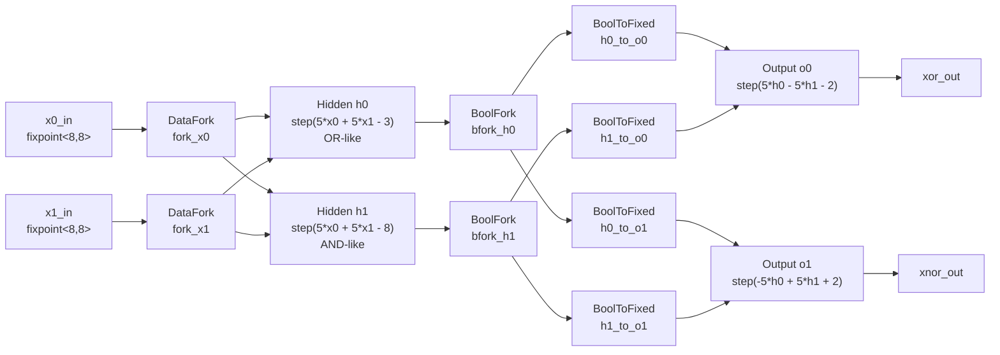

# Async-AI-Pipelines

This project implements a small asynchronous artificial neural network in ACT.
The current network models XOR using two fixed-point inputs, two hidden neurons,
and two output neurons that produce XOR and XNOR classifications.

## XOR ANN Pipeline



The network consumes one pair of fixed-point input tokens, distributes them to
two hidden neurons, converts hidden boolean activations back to fixed-point
tokens, and emits both XOR and XNOR classifications from the output layer.

## Architecture Details

The ANN is built from a few reusable asynchronous pipeline stages:

- `DataFork` copies each fixed-point input token to both hidden neurons.
- `Neuron<w0, w1, bias>` consumes two fixed-point inputs, computes a weighted
  sum, applies a step activation, and emits a boolean result.
- `BoolFork` copies each hidden activation to both output neurons.
- `BoolToFixed` converts hidden boolean activations into fixed-point tokens:
  `true` becomes `1.0`, and `false` becomes `0.0`.

The hidden layer outputs are boolean because the neuron does not forward the raw
weighted sum. Instead, it applies a threshold:

```text
acc = w0*x0 + w1*x1 + bias
output = true  if acc >= 0
output = false if acc < 0
```

The output layer still expects fixed-point inputs, so hidden booleans are
converted back into `math::fixpoint<8,8>` values before reaching `o0` and `o1`.

## Neuron Roles

| Neuron | Formula | Role |
| --- | --- | --- |
| `h0` | `step(5*x0 + 5*x1 - 3)` | OR-like hidden unit |
| `h1` | `step(5*x0 + 5*x1 - 8)` | AND-like hidden unit |
| `o0` | `step(5*h0 - 5*h1 - 2)` | XOR output |
| `o1` | `step(-5*h0 + 5*h1 + 2)` | XNOR output |

## Expected Truth Table

| `x0` | `x1` | `h0` | `h1` | `xor_out` | `xnor_out` |
| --- | --- | --- | --- | --- | --- |
| `0` | `0` | `0` | `0` | `0` | `1` |
| `0` | `1` | `1` | `0` | `1` | `0` |
| `1` | `0` | `1` | `0` | `1` | `0` |
| `1` | `1` | `1` | `1` | `0` | `1` |
