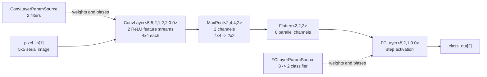
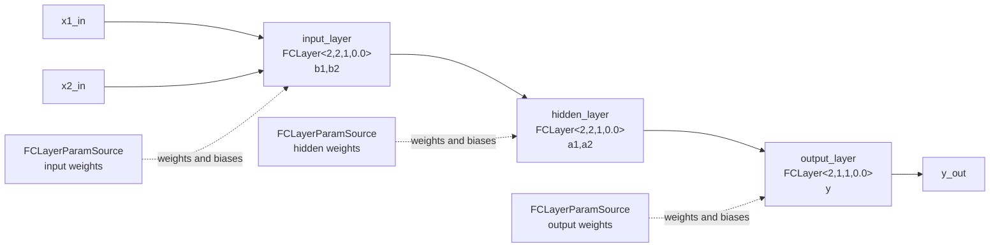

# Async AI Pipelines

This project contains ACT templates and examples for fixed-point asynchronous
neural-network pipelines.

All neural-network data, weight, bias, and activation ports use:

```act
math::fixpoint<8,8>
```

The main reusable layer library is:

```act
import "nn_layers.act";
```

`nn_layers.act` does not define a top-level `test` process. Use
`nn_layers_tb.act`, `simple_cnn.act`, or `xor_ann.act` for runnable examples.

## Layer Templates

`nn_layers.act` currently defines these templates:

| Template | Role |
| --- | --- |
| `Activation` | Standalone activation process |
| `WindowAssembler` | Converts one image stream into valid convolution windows |
| `WinFork` | Broadcasts one window to multiple convolution filters |
| `MaxPoolCh` | Parameterized `P x P` max-pooling for one channel |
| `MaxPool` | Multi-channel wrapper around `MaxPoolCh` |
| `Flatten` | Flattens feature-map streams into parallel vector channels |
| `FCLayerParamSource` | Sends one dense-layer weight/bias set |
| `FCLayer` | Channel-loaded fully connected layer with internal activation |
| `ConvLayerParamSource` | Sends one convolution weight/bias set |
| `ConvBank` | Channel-loaded convolution compute bank without activation |
| `ConvLayer` | Channel-loaded convolution layer with internal activation |

Dense and convolution layers receive weights and biases through channels once,
store them locally, and reuse them for later input streams. `FCLayer` and
`ConvLayer` instantiate `Activation` internally, so separate `Act` layer
variants are not needed.

## Activation

```act
template<pint ACT_FN; preal LEAK>
defproc Activation (chan?(math::fixpoint<8,8>) in;
                    chan!(math::fixpoint<8,8>) out)
```

| `ACT_FN` | Name | Output |
| --- | --- | --- |
| `0` | Linear | `x` |
| `1` | Step | `1.0` when `x >= 0`, else `0.0` |
| `2` | ReLU | `x` when `x >= 0`, else `0.0` |
| `3` | Leaky ReLU | `x` when `x >= 0`, else `LEAK * x` |

The implementation uses `~x.negative()` as the non-negative test.

## WindowAssembler

```act
template<pint IMG_W, IMG_H, K>
defproc WindowAssembler (chan?(math::fixpoint<8,8>) pix_in;
                         chan!(math::fixpoint<8,8>) win[K*K])
```

`WindowAssembler<IMG_W, IMG_H, K>` converts one row-major `IMG_W x IMG_H`
image stream into valid `K*K` sliding windows with zero padding and stride `1`.
It uses a `K`-row circular buffer.

For one image, it produces:

```text
(IMG_W - K + 1) * (IMG_H - K + 1)
```

windows. Each window is sent on `win[0..K*K-1]` in row-major kernel order.

## WinFork

```act
template<pint N_OUT, K>
defproc WinFork (chan?(math::fixpoint<8,8>) win_in[K*K];
                 chan!(math::fixpoint<8,8>) win_out[N_OUT][K*K])
```

`WinFork<N_OUT, K>` broadcasts each incoming `K*K` window to `N_OUT` filter
input streams. Each output filter receives an identical copy of the full
window.

## MaxPoolCh and MaxPool

```act
template<pint P, FEAT_W, FEAT_H>
defproc MaxPoolCh (chan?(math::fixpoint<8,8>) in;
                   chan!(math::fixpoint<8,8>) out)
```

`MaxPoolCh<P, FEAT_W, FEAT_H>` performs `P x P` max-pooling on one row-major
`FEAT_W x FEAT_H` feature-map stream. The effective stride is `P`, so:

```text
POOL_W = FEAT_W / P
POOL_H = FEAT_H / P
```

`FEAT_W` and `FEAT_H` should be divisible by `P`.

```act
template<pint N_CH, FEAT_W, FEAT_H, P>
defproc MaxPool (chan?(math::fixpoint<8,8>) feat_in[N_CH];
                 chan!(math::fixpoint<8,8>) pool_out[N_CH])
```

`MaxPool<N_CH, FEAT_W, FEAT_H, P>` applies `MaxPoolCh` independently to each
feature-map channel. Values are not mixed between channels.

## Flatten

```act
template<pint N_CH, FEAT_H, FEAT_W>
defproc Flatten (chan?(math::fixpoint<8,8>) feat_in[N_CH];
                 chan!(math::fixpoint<8,8>) flat_out[N_CH*FEAT_H*FEAT_W])
```

`Flatten<N_CH, FEAT_H, FEAT_W>` flattens row-major feature-map streams into
parallel output channels.

It reads values in row-column-channel order and emits to:

```text
flat_out[(r*FEAT_W + c)*N_CH + ch]
```

Example for `N_CH=2`, `FEAT_H=1`, `FEAT_W=3`:

```text
feat_in[0]: 1 2 3
feat_in[1]: 4 5 6

flat_out[0] = 1
flat_out[1] = 4
flat_out[2] = 2
flat_out[3] = 5
flat_out[4] = 3
flat_out[5] = 6
```

## FCLayerParamSource and FCLayer

```act
template<pint N_IN, N_OUT; preal W[N_OUT*N_IN], B[N_OUT]>
defproc FCLayerParamSource (chan!(math::fixpoint<8,8>) w_out[N_OUT*N_IN],
                            chan!(math::fixpoint<8,8>) b_out[N_OUT])
```

`FCLayerParamSource` sends all dense weights first, then all biases. Weight
order is output-major:

```text
W[j*N_IN + i] = weight from input i to output neuron j
```

```act
template<pint N_IN, N_OUT, ACT_FN; preal LEAK>
defproc FCLayer (chan?(math::fixpoint<8,8>) x_in[N_IN],
                 chan?(math::fixpoint<8,8>) w_in[N_OUT*N_IN],
                 chan?(math::fixpoint<8,8>) b_in[N_OUT];
                 chan!(math::fixpoint<8,8>) out[N_OUT])
```

`FCLayer` receives weights and biases once, then repeats this behavior:

```text
receive x_in[0..N_IN-1]
raw[j] = B[j] + sum_i W[j*N_IN + i] * x[i]
out[j] = Activation(raw[j])
```

Output neurons are computed in parallel over `j`; each neuron accumulates
sequentially over `i`.

## ConvLayerParamSource, ConvBank, and ConvLayer

```act
template<pint K, N_IN_CH, N_OUT;
         preal W[N_OUT*N_IN_CH*K*K], B[N_OUT]>
defproc ConvLayerParamSource (
  chan!(math::fixpoint<8,8>) w_out[N_OUT*N_IN_CH*K*K],
  chan!(math::fixpoint<8,8>) b_out[N_OUT])
```

Convolution weight order is filter-major, then input-channel-major, then
kernel-position:

```text
W[f*(N_IN_CH*K*K) + ch*K*K + k]
```

```act
template<pint K, N_IN_CH, N_OUT>
defproc ConvBank (chan?(math::fixpoint<8,8>) win[N_OUT][N_IN_CH][K*K],
                  chan?(math::fixpoint<8,8>) w_in[N_OUT*N_IN_CH*K*K],
                  chan?(math::fixpoint<8,8>) b_in[N_OUT];
                  chan!(math::fixpoint<8,8>) out[N_OUT])
```

`ConvBank` receives weights and biases once, then computes raw convolution
outputs for every incoming window set. There are `N_OUT` filters, and each
filter produces one output channel:

```text
out[f] = B[f] + sum_ch sum_k W[f,ch,k] * win[f][ch][k]
```

Filters are computed in parallel over `f`.

```act
template<pint IMG_W, IMG_H, K, N_IN_CH, N_OUT, ACT_FN; preal LEAK>
defproc ConvLayer (chan?(math::fixpoint<8,8>) pixel_in[N_IN_CH],
                   chan?(math::fixpoint<8,8>) w_in[N_OUT*N_IN_CH*K*K],
                   chan?(math::fixpoint<8,8>) b_in[N_OUT];
                   chan!(math::fixpoint<8,8>) feat_out[N_OUT])
```

`ConvLayer` wires the convolution pipeline internally:

```text
pixel_in
  -> WindowAssembler
  -> WinFork
  -> ConvBank
  -> Activation
  -> feat_out
```

For one `IMG_W x IMG_H` image:

```text
OUT_W = IMG_W - K + 1
OUT_H = IMG_H - K + 1
tokens per feat_out[f] = OUT_W * OUT_H
```

## Shape Rules

When `N_OUT` changes in a convolution layer, the number of output feature-map
streams changes too. Downstream layers must use the same channel count.

```text
ConvLayer output:  feat_out[N_OUT]
MaxPool input:     MaxPool<N_OUT, OUT_W, OUT_H, P>
Flatten input:     Flatten<N_OUT, POOL_H, POOL_W>
FCLayer input:     N_OUT * POOL_H * POOL_W
```

## Simple CNN

`simple_cnn.act` is a small CNN-style pipeline:

```text
Input:    5x5 image, 1 channel
Conv:     ConvLayer<5,5,2,1,2,ReLU>
Pool:     MaxPool<2,4,4,2>
Flatten:  Flatten<2,2,2> -> 8 parallel channels
FC:       FCLayer<8,2,step>
Output:   class_out[2]
```

Pipeline diagram:



The convolution layer uses two `2x2` filters:

```text
filter 0:
0.25  0.25
0.25  0.25

filter 1:
 1.00 -1.00
 1.00 -1.00
```

Filter 0 behaves like a small average. Filter 1 detects left/right contrast.
The convolution output is already ReLU-activated because `ACT_FN = 2`.

Pooling is:

```act
MaxPool<2, 4, 4, 2> pool1 (conv_out, pool_out);
```

Flattening is:

```act
Flatten<2, 2, 2> flat1 (pool_out, flat_out);
```

The classifier is:

```act
FCLayer<8, 2, 1, 0.0> fc1 (
  flat_out, fc_w, fc_b, class_out
);
```

`ACT_FN = 1` means `class_out[0]` and `class_out[1]` are step-activated
fixed-point values.

`SimpleCNNTestbench` sends this image:

```text
1 1 0 0 0
1 1 0 0 0
1 1 0 0 0
1 1 0 0 0
1 1 0 0 0
```

It receives `class_out[0]` and `class_out[1]`, compares each to `0.5`, and
logs boolean class results.

## XOR Neural Network

`xor_ann.act` is a three-layer fully connected threshold network:

```text
x1, x2
  -> input_layer   FCLayer<2,2,step>
  -> hidden_layer  FCLayer<2,2,step>
  -> output_layer  FCLayer<2,1,step>
  -> y
```

Pipeline diagram:



Expected truth table:

| `x1` | `x2` | `y` |
| --- | --- | --- |
| `0` | `0` | `0` |
| `0` | `1` | `1` |
| `1` | `0` | `1` |
| `1` | `1` | `0` |

Layer 1 thresholds the raw inputs:

```text
b1 = step(x1 - 0.5)
b2 = step(x2 - 0.5)
```

Layer 2 builds hidden features:

```text
a1 = step( b1 + b2 - 1)
a2 = step(-b1 - b2 + 1)
```

Layer 3 computes XOR:

```text
y = step(a1 + a2 - 2)
```

Each `FCLayer` receives its weights and biases once from a matching
`FCLayerParamSource`, then reuses those parameters for all four input cases in
the testbench.

The observed simulation output was:

```text
xor(0,0) = 0
xor(0,1) = 1
xor(1,0) = 1
xor(1,1) = 0
```

## Testbenches

`nn_layers_tb.act` contains focused functional tests for the reusable layer
templates plus an end-to-end mini-CNN test.

Current `Main` test labels:

```text
Activation/Linear
Activation/Step
Activation/ReLU
Activation/LeakyReLU
WindowAssembler
WinFork
ConvBank
Flatten
FCLayer
ConvLayer
MaxPoolCh
MaxPool
E2E mini-CNN
```


