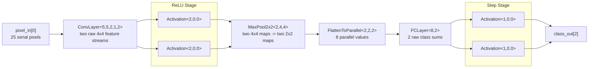

# Simple CNN

This document explains `simple_cnn.act`, a small fixed-point CNN-style
pipeline built from the reusable templates in `nn_layers.act`.

The example is intentionally small but now uses the parameterized `ConvLayer`
template for the convolution stage. `ConvLayer` internally builds the sliding
window path and parallel filter bank.

## Network Summary

```text
Input:       5x5 image, 1 channel
Conv:        two 2x2 filters, raw weighted sums
Activation:  ReLU per conv output channel
Pool:        2x2 max-pool per channel, 4x4 -> 2x2
Flatten:     2 channels * 2 * 2 = 8 parallel values
FC:          8 inputs -> 2 raw class sums
Activation:  step per class output
```

All data channels use:

```act
math::fixpoint<8,8>
```

## Pipeline Diagram



## Convolution Layer

The input is one serial grayscale stream:

```act
chan?(math::fixpoint<8,8>) pixel_in[1]
```

`pixel_in[0]` receives the 25 image values in row-major order.

The convolution stage is:

```act
ConvLayer<5, 5, 2, 1, 2, W, B> conv1 (pixel_in, conv_out);
```

The template parameters mean:

```text
IMG_W   = 5
IMG_H   = 5
K       = 2
N_IN_CH = 1
N_OUT   = 2
```

Internally, `ConvLayer` uses `WindowAssembler`, `WinFork`, channel
rearrangement, and `ConvBank`. `ConvBank` computes the two output filters with
parallel CHP branches.

The weight array contains two filters:

```text
filter 0:  0.25,  0.25,
           0.25,  0.25

filter 1:  1.00, -1.00,
           1.00, -1.00
```

Filter 0 is an averaging-like detector. Filter 1 is a horizontal contrast
detector.

`ConvLayer` emits one `4x4` stream per output filter, so there are two parallel
convolution output streams:

```act
conv_out[0]
conv_out[1]
```

## ReLU Stage

`ConvLayer` emits raw weighted sums. ReLU is a separate visible pipeline stage:

```act
Activation<2, 0.0> conv_relu[2];
```

Activation code `2` means ReLU:

```text
output = acc if acc >= 0 else 0.0
```

The activated streams are:

```act
conv_act[0]
conv_act[1]
```

## Max Pool

Pooling is applied independently to both feature-map channels:

```act
MaxPool2x2<2, 4, 4> pool1 (conv_act, pool_out);
```

The first template parameter is the number of channels:

```text
N_CH = 2
```

Each `4x4` feature map becomes a `2x2` pooled map, so each channel emits four
values:

```text
pool_out[0]: 4 values
pool_out[1]: 4 values
```

## Flatten

The pooled output is converted to eight parallel channels:

```act
FlattenToParallel<2, 2, 2> flat1 (pool_out, flat_out);
```

The output has:

```act
flat_out[8]
```

`FlattenToParallel` emits in row/column/channel order:

```text
flat_out[0] = row 0, col 0, channel 0
flat_out[1] = row 0, col 0, channel 1
flat_out[2] = row 0, col 1, channel 0
flat_out[3] = row 0, col 1, channel 1
...
```

This ordering matches the sequential input receive order of `FCLayer<8,2>`.

## Fully Connected Classifier

The dense layer is:

```act
FCLayer<8, 2, W, B> fc1 (flat_out, fc_raw);
```

It has:

```text
N_IN  = 8 input activations
N_OUT = 2 output neurons
```

The weight layout is:

```text
W[j*N_IN + i]
```

So the first 8 weights belong to class neuron 0, and the next 8 weights belong
to class neuron 1.

In this example:

```text
class 0 uses channel-0 flattened values
class 1 uses channel-1 flattened values
```

The bias for class 1 is more negative than class 0:

```act
{ -0.5, -4.5 }
```

That makes the left-block test image fire class 0 while keeping class 1 below
the final step threshold.

The raw dense outputs are:

```act
fc_raw[0]
fc_raw[1]
```

## Step Output

The final class outputs use step activation:

```act
Activation<1, 0.0> class_act[2];
```

Activation code `1` means:

```text
output = 1.0 if raw sum >= 0 else 0.0
```

The final output channels are:

```act
class_out[0]
class_out[1]
```

## Testbench

`SimpleCNN_Testbench` sends one `5x5` image into `pixel_out[0]`. The test image
has high values on the left and low values on the right:

```text
1 1 0 0 0
1 1 0 0 0
1 1 0 0 0
1 1 0 0 0
1 1 0 0 0
```

After receiving both class outputs, the testbench converts fixed-point class
values to bools using a `0.5` threshold:

```act
diff := c0 - half;
[ ~diff.negative() -> b0 := true [] else -> b0 := false ];
```

Then it logs:

```act
log("class_out[0] = ", b0);
log("class_out[1] = ", b1)
```

## Parallelism

The visible parallel parts are:

```text
ConvLayer filter branches:  two filters inside ConvBank
two ReLU activations:       conv_relu[0] and conv_relu[1]
two pool channel processes: MaxPool2x2<2,4,4>
eight FC input channels:    flat_out[8]
two class activations:      class_act[0] and class_act[1]
```

The pixel input itself is still serial:

```text
pixel_in[0] receives one pixel per handshake
```

This is a common hardware streaming pattern: serial pixels enter a line/window
buffer, then downstream filter and channel work can run in parallel.
