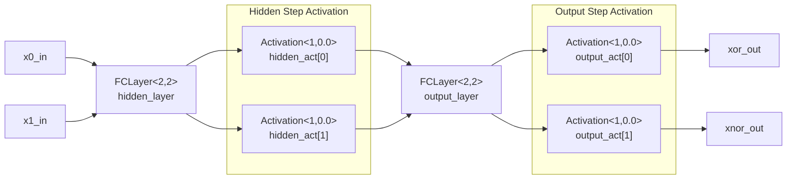

# XOR Neural Network With FCLayer

This document explains `xor_nn_fclayer.act`, a small fixed-point XOR/XNOR
network built from the reusable templates in `nn_layers.act`.

The example uses `FCLayer` for the weighted sums and separate `Activation`
processes for the step functions. That makes the hidden layer, output layer,
and activation stages visible as separate asynchronous pipeline blocks.

## Network Summary

```text
x0, x1
  -> FCLayer<2,2> hidden weighted sums
  -> Activation<1,0.0> hidden step outputs
  -> FCLayer<2,2> output weighted sums
  -> Activation<1,0.0> final step outputs
  -> xor_out, xnor_out
```

All network channels use:

```act
math::fixpoint<8,8>
```

The expected truth table is:

| `x0` | `x1` | `xor_out` | `xnor_out` |
| ---- | ---- | --------- | ---------- |
| `0`  | `0`  | `0`       | `1`        |
| `0`  | `1`  | `1`       | `0`        |
| `1`  | `0`  | `1`       | `0`        |
| `1`  | `1`  | `0`       | `1`        |

## Pipeline Diagram



## Input Wiring

`XOR_ANN` receives two scalar input channels:

```act
chan?(math::fixpoint<8,8>) x0_in, x1_in
```

The `FCLayer` template expects an array of input channels, so the two scalar
inputs are assigned into `input_vec`:

```act
input_vec[0] = x0_in;
input_vec[1] = x1_in;
```

This only wires the external input channels into the shape required by
`FCLayer<2,2>`.

## Hidden Layer

The hidden layer is:

```act
FCLayer<2, 2,
        { 5.0, 5.0,
          5.0, 5.0 },
        { -3.0, -8.0 }> hidden_layer (input_vec, hidden_raw);
```

`FCLayer<N_IN,N_OUT>` receives one value from each input channel, then computes
the output weighted sums with parallel CHP branches.

For this hidden layer:

```text
h0_raw = 5*x0 + 5*x1 - 3
h1_raw = 5*x0 + 5*x1 - 8
```

The weight array is stored output-major:

```text
W[j*N_IN + i]
```

So for `N_IN = 2` and `N_OUT = 2`:

```text
W[0] = weight from x0 to h0
W[1] = weight from x1 to h0
W[2] = weight from x0 to h1
W[3] = weight from x1 to h1
```

## Hidden Activation

The hidden weighted sums are sent through two separate step activation
processes:

```act
Activation<1, 0.0> hidden_act[2];
```

`ACT_FN = 1` means step activation:

```text
output = 1.0 when input >= 0
output = 0.0 when input < 0
```

That produces:

```text
h0 = step(5*x0 + 5*x1 - 3)
h1 = step(5*x0 + 5*x1 - 8)
```

For binary inputs, `h0` acts like an OR detector and `h1` acts like an AND
detector:

| `x0` | `x1` | `h0` | `h1` |
| ---- | ---- | ---- | ---- |
| `0`  | `0`  | `0`  | `0`  |
| `0`  | `1`  | `1`  | `0`  |
| `1`  | `0`  | `1`  | `0`  |
| `1`  | `1`  | `1`  | `1`  |

## Output Layer

The output layer consumes the two hidden activations:

```act
FCLayer<2, 2,
        {  5.0, -5.0,
          -5.0,  5.0 },
        { -2.0, 2.0 }> output_layer;
```

It is wired explicitly:

```act
output_layer.x_in[0..1] = hidden_out[0..1];
output_layer.out[0..1] = output_raw[0..1];
```

The two raw output sums are:

```text
xor_raw  =  5*h0 - 5*h1 - 2
xnor_raw = -5*h0 + 5*h1 + 2
```

After step activation:

```text
xor_out  = step( 5*h0 - 5*h1 - 2)
xnor_out = step(-5*h0 + 5*h1 + 2)
```

## Why Activation Is Separate Here

This file uses raw `FCLayer` followed by standalone `Activation` processes:

```text
FCLayer -> Activation
```

That creates a real asynchronous pipeline boundary between the weighted-sum
stage and the activation stage. The parallel FC layer sends raw fixed-point
tokens on `hidden_raw` and `output_raw`, and each `Activation` process receives
those tokens through channels before producing the next result.

This is different from using `FCLayerAct`, where the activation is computed
inside the same process as the weighted sum and no internal activation channel
is created.

## Testbench

`XorTestbench` sends all four binary input combinations:

```text
(0,0)
(0,1)
(1,0)
(1,1)
```

For each case, it receives `xor_out` and `xnor_out` as fixed-point values.
Because logging fixed-point values directly is less convenient, the testbench
converts each result to a boolean before printing:

```act
diff := xv - half;
[ ~diff.negative() -> xb := true [] else -> xb := false ];
```

This treats values greater than or equal to `0.5` as `true`, and values below
`0.5` as `false`.

The log output should match:

```text
xor(0,0) = false
xnor(0,0) = true
xor(0,1) = true
xnor(0,1) = false
xor(1,0) = true
xnor(1,0) = false
xor(1,1) = false
xnor(1,1) = true
```

## Parallelism

The input channels to each `FCLayer` are parallel at the interface:

```act
chan?(math::fixpoint<8,8>) x_in[N_IN]
```

Internally, `FCLayer` first receives the full input vector. Then each output
neuron uses a parallel CHP branch with its own accumulator and loop index, so
the hidden weighted sums can compute in parallel and the output weighted sums
can also compute in parallel.

The two `Activation` instances in each activation stage are separate processes,
so `hidden_act[0]` and `hidden_act[1]` can operate independently once their
input tokens are available.
