# CNN ACT Pipeline Explanation

This document explains `cnn.act`, which implements an asynchronous CNN-style
inference pipeline using ACT channels and CHP processes.

The example network consumes one `8x8` grayscale image as a stream of `int<8>`
pixels and emits four class-score streams. The implementation uses explicit
channel handshakes between stages, so each block can run as an asynchronous
pipeline process.

## Pipeline Diagram

```mermaid
flowchart LR
    src["pixel_in<br/>64 serial int&lt;8&gt; pixels"]

    subgraph conv["ConvLayer&lt;8,8,3,1,4,ReLU&gt;"]
        wa["WindowAssembler<br/>builds 3x3 windows"]
        wf["WinFork<br/>copies each window to 4 filters"]
        cb["ConvBank<br/>4 convolution filters"]
    end

    pool["MaxPool2x2&lt;4,6,6&gt;<br/>4 channels: 6x6 -> 3x3"]
    flat["Flatten&lt;4,3,3&gt;<br/>4x3x3 -> 36 serial values"]
    fc1["FCLayer&lt;36,8,ReLU&gt;<br/>hidden dense layer"]
    flat2["Flatten&lt;8,1,1&gt;<br/>8 parallel values -> serial"]
    fc2["FCLayer&lt;8,4,Step&gt;<br/>4 class outputs"]
    out["class_out[4]<br/>binary scores"]

    src --> wa --> wf --> cb --> pool --> flat --> fc1 --> flat2 --> fc2 --> out
```



## Top-Level Flow

`Top` instantiates `CNN_Testbench`, which instantiates `CNN_Example`.

`CNN_Testbench` sends one all-zero `8x8` image into the CNN and receives four
class outputs:

```act
CNN_Example cnn (pix_in, class_out);
```

`CNN_Example` wires the full pipeline:

1. `ConvLayer<8, 8, 3, 1, 4, 1>` produces four `6x6` feature-map streams.
2. `MaxPool2x2<4, 6, 6>` reduces each feature map from `6x6` to `3x3`.
3. `Flatten<4, 3, 3>` serializes all pooled features into 36 values.
4. `FCLayer<36, 8, 1>` computes an 8-value hidden layer with ReLU.
5. `Flatten<8, 1, 1>` serializes the 8 hidden outputs.
6. `FCLayer<8, 4, 0>` produces four step-activated class scores.

Activation codes:

| Code | Name | Meaning |
| --- | --- | --- |
| `0` | `ACT_STEP` | outputs `0` or `1` based on `pos >= neg` |
| `1` | `ACT_RELU` | outputs `max(pos - neg, 0)`, clamped to `127` |
| `2` | `ACT_LRELU` | ReLU for positive values, `diff >> 3` for negatives |

## Process Roles

### `WindowAssembler`

`WindowAssembler<IMG_W, IMG_H, K>` receives one pixel stream in row-major order.
It stores the most recent `K` rows in a circular buffer and emits one `K*K`
window whenever the current pixel completes a valid convolution window.

For the example:

```text
Input image: 8x8
Kernel:      3x3
Output:      6x6 windows
```

Each valid output window is sent through `win[0..K*K-1]`.

### `WinFork`

`WinFork<N_OUT, K>` receives one complete `K*K` window and sends a copy of that
window to each output filter. This is necessary because ACT channels cannot be
implicitly forked.

For the example, one `3x3` window is copied to four convolution filters.

### `ConvBank`

`ConvBank<K, N_IN_CH, N_OUT, ACT_FN, PW, PC, NW, NC>` computes all convolution
filters in one homogeneous process.

The code uses separate positive and negative weight arrays because `int<N>` is
unsigned in ACT:

```text
pos = sum(PW * input) + PC
neg = sum(NW * input) + NC
effective signed value = pos - neg
```

Weights are flattened using:

```text
index = filter * (N_IN_CH*K*K) + input_channel * (K*K) + kernel_index
```

The bank design avoids ACT sparse-array type errors that occur when each filter
is instantiated as a separate process with a different template weight slice.

### `MaxPool2x2`

`MaxPool2x2<N_CH, FEAT_W, FEAT_H>` creates one `MaxPool2x2Ch` process per
channel. Each channel process reads two rows at a time, takes the maximum of
each `2x2` block, and outputs one pooled value.

For the example:

```text
Input per channel:  6x6
Output per channel: 3x3
Channels:           4
```

### `Flatten`

`Flatten<N_CH, FEAT_H, FEAT_W>` converts parallel feature-map channels into one
serial stream.

Output order is:

```text
channel 0, row-major
channel 1, row-major
...
channel N_CH-1, row-major
```

The implementation uses compile-time CHP replication for channel indexing,
because ACT does not support dynamic channel-array indexing.

### `FCBank` and `FCLayer`

`FCLayer<N_IN, N_OUT, ACT_FN, PW, PC, NW, NC>` first receives `N_IN` serial
values and broadcasts them to an `FCBank`.

`FCBank` computes all output neurons in one homogeneous process:

```text
pos[j] = sum_i(PW[j*N_IN + i] * x[i]) + PC[j]
neg[j] = sum_i(NW[j*N_IN + i] * x[i]) + NC[j]
```

Like `ConvBank`, `FCBank` avoids sparse-array type errors from per-neuron
template specializations.

## Logging

The file contains `log(...)` calls in the active CHP processes. These logs trace
major token transfers and computed values:

- `WindowAssembler` logs incoming pixels and emitted windows.
- `WinFork` logs received and broadcast windows.
- `ConvBank` logs received batches and per-filter `pos`/`neg` values.
- `MaxPool2x2Ch` and `AvgPool2x2Ch` log pooled outputs.
- `Flatten` logs serialized values.
- `FCLayer` and `FCBank` log buffered inputs and neuron outputs.
- `CNN_Testbench` logs image sending and final class outputs.

The logs are intended for simulation/debugging, not synthesis.

## Important ACT Constraints Reflected in the Code

Several implementation choices are shaped by ACT limitations:

- Channel arrays cannot be indexed dynamically inside CHP, so compile-time
  replication is used where channel indices appear.
- Array process instances should be declared separately and wired using named
  port assignments instead of connection lists.
- Sparse arrays cannot contain different template specializations under the
  same identifier, so `ConvBank` and `FCBank` keep heterogeneous weights inside
  one homogeneous process type.
- Unsigned `int<N>` arithmetic can underflow, so `WindowAssembler` computes
  `start_col` only after the valid-window guard is true.

## Running

The file defines a global top-level instance:

```act
Top top;
```

Typical simulation target:

```bash
actsim -ref=1 -Wlang_subst:off -Tsky130l cnn.act Top
```

or use the equivalent command configured for your local ACT installation.
